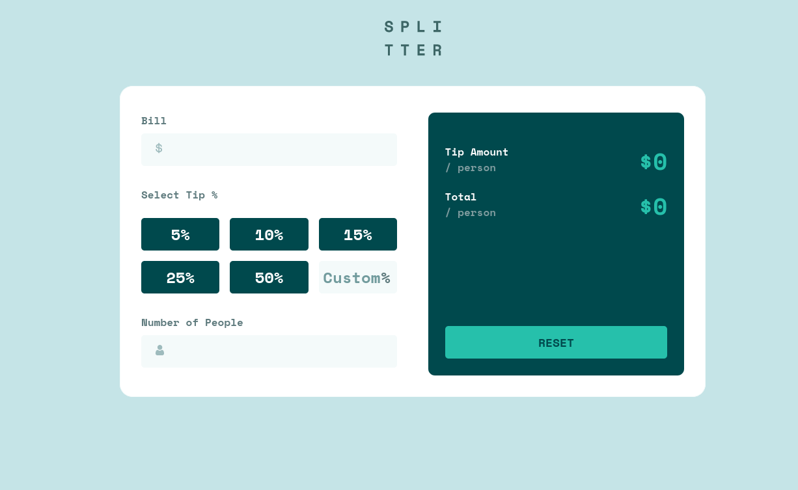
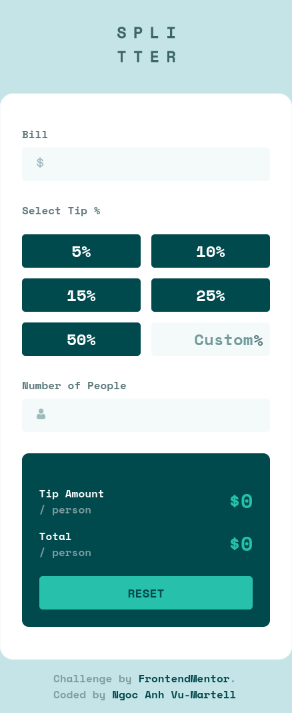

# Frontend Mentor - Tip calculator app solution

This is a solution to the [Tip calculator app challenge on Frontend Mentor](https://www.frontendmentor.io/challenges/tip-calculator-app-ugJNGbJUX). Frontend Mentor challenges help you improve your coding skills by building realistic projects.

## Table of contents

- [Overview](#overview)
  - [The challenge](#the-challenge)
  - [Screenshot](#screenshot)
  - [Links](#links)
- [My process](#my-process)
  - [Built with](#built-with)
  - [What I learned](#what-i-learned)
  - [Continued development](#continued-development)
  - [Useful resources](#useful-resources)
- [Author](#author)
- [Acknowledgments](#acknowledgments)

## Overview

### The challenge

Users should be able to:

- View the optimal layout for the app depending on their device's screen size
- See hover states for all interactive elements on the page
- Calculate the correct tip and total cost of the bill per person
- Reset all input fields when needed

### Screenshot




### Links

- Solution URL: [Code base](https://github.com/anh-vumartell/tip-calculator-app)
- Live Site URL: [Handy Tip Calculator](https://handy-tip-calculator.netlify.app/)

## My process

### Built with

- CSS Grid
- Mobile-first workflow
- [React](https://reactjs.org/) - JS library
- CSS Preprocessor: Sass

### What I learned

- I learned create a new React Project from setting up the development environment to deploying it to the web.
- I learned how to set up Sass folder tree.
- I used drawn layout (on paper) to visualise the position of each element.

- I learned how to use React Hook useState() to manage the state of user's inputs inside the application

```js
const [billInput, setBillInput] = useState(0);
const [personNumInput, setPersonNumInput] = useState(1);
const [selectedPercent, setSelectedPercent] = useState();
const [inputPercent, setInputPercent] = useState("");

//Function to update selected percentage
const updatePercentage = (e) => {
  e.persist();
  setInputPercent(e.target.value);

  setSelectedPercent(e.target.value);
};
//FUnction to update bill
const updateBill = (e) => {
  setBillInput(e.target.value);
};
```

- Create custom component to render tip results

```html
<div className="result-container">
  <TipResult header="Tip Amount" result="{tipAmountPer}" />

  <TipResult header="Total" result="{totalPer}" />

  <button type="button" className="btn-reset" onClick="{resetAllInputs}">
    Reset
  </button>
</div>
```

### Continued development

- Validate input field.
- Use styled components
- Seperate the app logic and app UI
- Reorganise Sass files

### Useful resources

- [Sass Crash Course - Traversy Media](https://www.youtube.com/watch?v=nu5mdN2JIwM&t=1415s) - This helped me understand how to use Sass in my project. I really like how the instructor explains the basic concepts and style rules. The example project is simple enough to understand. I'd really recommend this tutorial for anyone who is starting out with Sass.

- [React useState Hook in Action: What You Need to Know](https://blog.alexdevero.com/react-usestate-hook-in-action/) - This is an amazing article which helped me finally understand React useState Hook. I'd recommend it to anyone still learning this concept.

- [Styled Components] (https://styled-components.com/docs/basics#motivation) - A detail documentation on styled components.

## Author

- Website - [Ngoc Anh Vu-Martell](https://anh-vumartell.netlify.app/)
- Frontend Mentor - [@anh-vumartell](https://www.frontendmentor.io/profile/anh-vumartell)
- Twitter - [@VuMartell](https://twitter.com/VuMartell)

